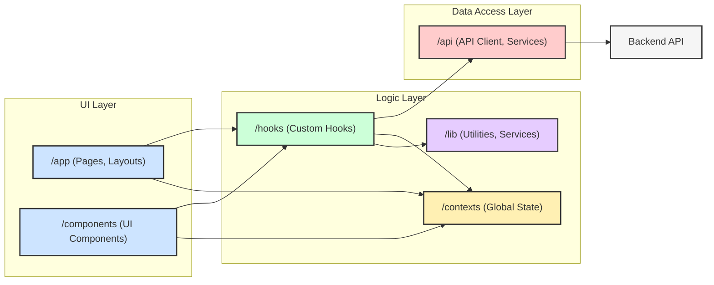

# フロントエンド依存関係概要 (@app, @hooks, @api)

## 概要

このドキュメントは、`startup_wellness_analyze` アプリケーションの新しいフロントエンド (`@new-frontend-idea`) における主要なディレクトリ、特に `@app` (UI層)、`@hooks` (ビジネスロジック層)、`@api` (データアクセス層) 間の依存関係とデータフローをまとめたものです。
`description.md` および `frontend-to-moving.md` を参考に、現在のフロントエンドアーキテクチャにおける主要なコンポーネント間の連携を明確にすることを目的としています。

## ディレクトリの役割

*   **`/app`**: Next.js App Router によるルーティングとUI表示を担当します。
    *   ページコンポーネント (`page.tsx`)、レイアウト (`layout.tsx`)、およびUI表示に特化したコンポーネント（`/components` 内など）が含まれます。
    *   主に `@hooks` を利用して、表示に必要なデータや状態管理ロジックを取得・操作します。
    *   `globals.css` でグローバルスタイルを定義します。
    *   認証関連のページ (`/login`) や主要機能ページ (`/analysis`, `/companies`, `/reports`) のエントリーポイントとなります。
*   **`/hooks`**: 再利用可能なビジネスロジック、状態管理、およびAPI通信の抽象化を担当するカスタムReactフックを格納します。
    *   `useState`, `useEffect`, `useCallback` などの基本的なReactフックに加え、アプリケーション固有のロジック（認証、WebSocket、チャット状態管理、データ分析など）をカプセル化します。
    *   `@api` を利用してバックエンドとの通信を行い、取得したデータや状態を整形して `@app` 層に提供します。
    *   Context API (`@contexts`) と連携してグローバルな状態を管理することもあります（例: `useAuth`）。
    *   ユーティリティ関数 (`@lib/utils`) や特定のサービス (`@lib/offline-queue`, `@lib/ai-insights-generator`) を利用します。
    *   **注意**: 既存の `@src/hooks` から移行されたフックが多く、Next.js環境（特にClient Components）で動作するように `"use client"` ディレクティブの追加や調整が行われています。 (`frontend-to-moving.md` 参照)
*   **`/api`**: バックエンドAPIとの直接的な通信を担当するクライアントや関連モジュールを格納します。
    *   `apiClient.ts` は `axios` ベースのAPIクライアント実装を提供し、リクエスト/レスポンスのインターセプター、認証ヘッダーの付与、共通のエラーハンドリングなどを行います。
    *   特定のAPIエンドポイント群に対応するサービス関数（例: `/api/services/` 内）を含む場合があります。
    *   主に `@hooks` 層から利用され、具体的なHTTPリクエストを実行します。
    *   **注意**: 既存の `@src/api` から移行され、Next.js環境 (環境変数 `process.env`, `window` オブジェクトのチェックなど) に合わせて調整されています。 (`frontend-to-moving.md` 参照)

## 主要な依存関係フロー

*   **UI層 (`/app`, `/components`)**:
    *   ページやUIコンポーネントは、表示に必要なデータやビジネスロジックを `@hooks` から取得します (例: `useChatState`, `useCompanyData`)。
    *   ユーザー操作（ボタンクリック、フォーム送信など）に応じて、`@hooks` が提供する関数を呼び出し、状態更新やAPIリクエストをトリガーします。
    *   グローバルな状態（認証情報など）は `@contexts` (例: `AuthContext`) を通じて利用します。
    *   原則として `@api` を直接呼び出すべきではありません。API通信は `@hooks` に隠蔽されるべきです。
*   **ロジック層 (`/hooks`, `/contexts`, `/lib`)**:
    *   `@hooks` は、バックエンドとの通信が必要な場合に `@api` の `apiClient` を利用します。
    *   複雑な状態管理ロジックや、複数のAPI呼び出しを伴うビジネスロジックをカプセル化します (例: `useChatState` は WebSocket通信、状態更新、オフラインキュー管理を行う)。
    *   `@contexts` はアプリケーション全体で共有される状態（例: 認証状態）を提供し、関連する `@hooks` (例: `useAuth`) と連携します。
    *   `@lib` は、汎用的なユーティリティ (`utils.ts`) や、特定のドメインロジックを持つサービス (`OfflineQueueService`, `ai-insights-generator.ts`) を提供し、`@hooks` から利用されます。
*   **データアクセス層 (`/api`)**:
    *   `apiClient.ts` は、API通信の基盤（ベースURL、認証トークン付与、エラーハンドリング）を提供します。
    *   `@hooks` からの指示に基づき、具体的なAPIリクエスト（GET, POST など）をバックエンドに送信します。

## 具体的な連携例

*   **認証フロー**:
    1.  `@app/login/page.tsx` (UI層) がユーザー入力に基づき `useAuth` (@hooks) の `login` 関数を呼び出す。
    2.  `useAuth` (@hooks) は `@api/apiClient` を利用してバックエンドの認証APIを呼び出す。
    3.  `apiClient` (@api) がHTTPリクエストを送信し、レスポンスを受け取る。
    4.  `useAuth` (@hooks) はレスポンスに基づき認証状態 (`AuthContext`) を更新する。
    5.  `@app/layout.tsx` (UI層) などが `AuthContext` の変更を検知し、UI（ナビゲーションなど）を更新する。
*   **チャット機能 (`useChatState`)**:
    1.  `@components/chat-view.tsx` (UI層) が `useChatState` (@hooks) を利用。
    2.  ユーザーメッセージ送信時、`useChatState` の `addUserMessage` が呼ばれる。
    3.  `addUserMessage` は、オンラインなら `useWebSocketConnection` (@hooks) を介してメッセージ送信 (`sendMessage`)。
    4.  オフラインなら `@lib/OfflineQueueService` にメッセージを追加。
    5.  `useChatState` は `ChatMessage` の状態 (`messages`) を更新し、UIに反映させる。
    6.  `OfflineQueueService` はネットワーク状態を監視し、オンライン復帰時にキュー内のメッセージを `@api` (間接的にWebSocket経由) を使って送信試行する。
    7.  `useChatState` は `useAuth` (@hooks) からユーザー情報を、`useToast` (@hooks) から通知機能を利用する。

## 参照ドキュメント

*   `description.md`: 新フロントエンドの全体構造と各ディレクトリの概要。
*   `frontend-to-moving.md`: 既存フロントエンドからの移行計画と、再利用されるモジュールに関する詳細情報。特にフェーズ1, 2で `@hooks`, `@api`, `@lib`, `@contexts` がどのように移行・調整されたかが記載されています。

---

**注記**: このドキュメントは現在のコードベースの構造と理解に基づいています。開発の進行に伴い、依存関係が変化する可能性があるため、定期的な見直しと更新を推奨します。